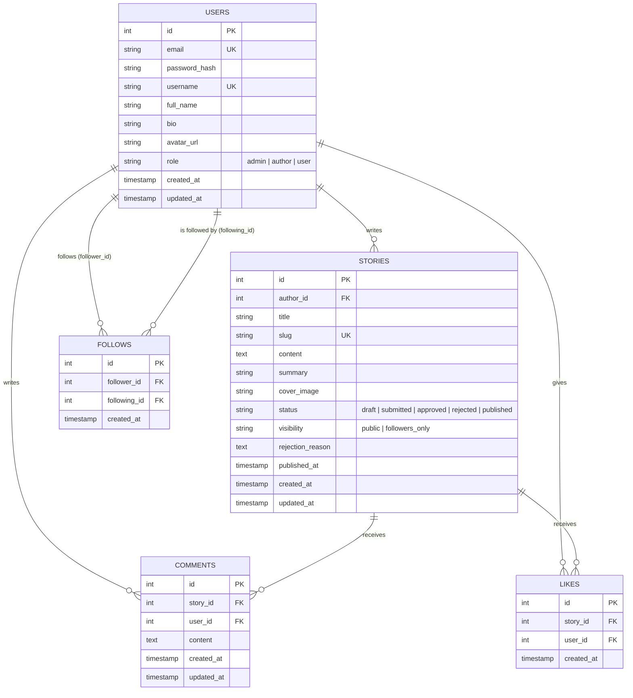

# Implementation Plan: Medium-like Publishing Platform API (Node.js + TypeORM)

This document provides an end-to-end architectural design, domain models, database schema, permission matrices, API specifications, and phased step-by-step implementation workflow for building a Medium-inspired backend POC in Node.js with TypeORM and PostgreSQL.

---

## 1. System Architecture & High-Level Design

### 1.1 Architectural Pattern

A classic **4-Layer Separation of Concerns (SoC)** Architecture:

```
HTTP Request
     │
     ▼
[ 1. Routing & Middleware Layer ]
   - JWT Auth (`authenticateToken`)
   - Role Checks (`authorizeRoles('admin', 'author', 'user')`)
   - Resource Ownership Guards (`checkOwnership(Story)`)
   - Input Validation (Joi / Zod)
     │
     ▼
[ 2. Controller Layer ]
   - Unpacks `req.body`, `req.params`, `req.query`, `req.user`
   - Formats HTTP responses (200, 201, 400, 403, 404, 500)
     │
     ▼
[ 3. Service Layer (Core Business Logic) ]
   - State transition rules (draft -> submitted -> approved/rejected -> published)
   - Visibility checks (public vs followers-only access control)
   - Follower notification hooks / aggregations
     │
     ▼
[ 4. Repository / Data Access Layer (TypeORM) ]
   - Entity definitions, QueryBuilder joins, relations, transactions
     │
     ▼
PostgreSQL Database
```

---

## 2. Database Schema & Entities (ER Design)

### 2.1 Entity Relationship Diagram



### 2.2 Entity Details & Column Mappings

1. **User (`users`)**:
   - `id`: `serial` primary key
   - `email`: `varchar(255)` unique, indexed
   - `password`: `varchar(255)` (hashed with bcrypt / argon2)
   - `username`: `varchar(100)` unique, indexed
   - `fullName`: `varchar(150)`
   - `bio`: `text` nullable
   - `avatarUrl`: `varchar(500)` nullable
   - `role`: enum (`admin`, `author`, `user`), default `user`
   - Timestamps (`createdAt`, `updatedAt`)

2. **Story (`stories`)**:
   - `id`: `serial` primary key
   - `authorId`: `int` foreign key referencing `users(id)` ON DELETE CASCADE
   - `title`: `varchar(255)`
   - `slug`: `varchar(300)` unique indexed (e.g. `my-awesome-post-a8f1`)
   - `content`: `text` (Markdown or HTML/JSON content)
   - `summary`: `varchar(500)` short description
   - `coverImageUrl`: `varchar(500)` nullable
   - `status`: enum:
     - `'draft'`: Editable by author, visible only to author.
     - `'submitted'`: Under review, waiting for Admin.
     - `'approved'`: Approved by Admin, ready to publish or auto-published.
     - `'rejected'`: Rejected by Admin with reason.
     - `'published'`: Live and viewable according to `visibility`.
   - `visibility`: enum (`public`, `followers_only`), default `public`
   - `rejectionReason`: `text` nullable (filled by Admin when rejecting)
   - `publishedAt`: `timestamptz` nullable
   - Timestamps (`createdAt`, `updatedAt`)

3. **Follow (`follows`)**:
   - `id`: `serial` primary key
   - `followerId`: `int` referencing `users(id)`
   - `followingId`: `int` referencing `users(id)`
   - Unique composite index on `(follower_id, following_id)`
   - Constraint: `follower_id != following_id` (cannot follow oneself)

4. **Comment (`comments`)**:
   - `id`: `serial` primary key
   - `storyId`: `int` referencing `stories(id)` ON DELETE CASCADE
   - `userId`: `int` referencing `users(id)` ON DELETE CASCADE
   - `content`: `text`
   - Timestamps (`createdAt`, `updatedAt`)

5. **Like (`likes`)**:
   - `id`: `serial` primary key
   - `storyId`: `int` referencing `stories(id)` ON DELETE CASCADE
   - `userId`: `int` referencing `users(id)` ON DELETE CASCADE
   - Unique composite index on `(story_id, user_id)` (one like per user per story)

---

### 2.3 TypeORM Migrations Blueprint (Database Setup & Script Execution)

To manage database schema evolution safely and professionally, we use TypeORM timestamped migration files instead of ad-hoc SQL files or `synchronize: true`.

#### Migration Execution Workflow & Commands
All migrations are run against `src/database/data-source.js` via npm scripts defined in `package.json`:
```bash
# 1. Run all pending migrations
npm run migration:run

# 2. Roll back the last applied migration
npm run migration:revert

# 3. Create a blank migration template
npm run migration:create -- src/database/migrations/MigrationName
```

#### Migration Files Specification:

##### File 1: `src/database/migrations/1700000001000-CreateUsersTable.js`
Creates the `users` table, unique indexes, and role checks.
```javascript
class CreateUsersTable1700000001000 {
  name = 'CreateUsersTable1700000001000';

  async up(queryRunner) {
    await queryRunner.query(`
      CREATE TABLE IF NOT EXISTS "users" (
        "id" SERIAL PRIMARY KEY,
        "email" VARCHAR(255) NOT NULL UNIQUE,
        "password" VARCHAR(255) NOT NULL,
        "username" VARCHAR(100) NOT NULL UNIQUE,
        "full_name" VARCHAR(150) NOT NULL,
        "bio" TEXT,
        "avatar_url" VARCHAR(500),
        "role" VARCHAR(20) NOT NULL DEFAULT 'user' CHECK ("role" IN ('admin', 'author', 'user')),
        "created_at" TIMESTAMP WITH TIME ZONE NOT NULL DEFAULT CURRENT_TIMESTAMP,
        "updated_at" TIMESTAMP WITH TIME ZONE NOT NULL DEFAULT CURRENT_TIMESTAMP
      );
    `);
    await queryRunner.query(`CREATE INDEX "idx_users_email" ON "users" ("email");`);
    await queryRunner.query(`CREATE INDEX "idx_users_username" ON "users" ("username");`);
    await queryRunner.query(`CREATE INDEX "idx_users_role" ON "users" ("role");`);
  }

  async down(queryRunner) {
    await queryRunner.query(`DROP TABLE IF EXISTS "users" CASCADE;`);
  }
}

module.exports = CreateUsersTable1700000001000;
```

##### File 2: `src/database/migrations/1700000002000-CreateStoriesTable.js`
Creates the `stories` table, foreign keys to `users`, enum status/visibility checks, and indexes.
```javascript
class CreateStoriesTable1700000002000 {
  name = 'CreateStoriesTable1700000002000';

  async up(queryRunner) {
    await queryRunner.query(`
      CREATE TABLE IF NOT EXISTS "stories" (
        "id" SERIAL PRIMARY KEY,
        "author_id" INT NOT NULL REFERENCES "users"("id") ON DELETE CASCADE,
        "title" VARCHAR(255) NOT NULL,
        "slug" VARCHAR(300) NOT NULL UNIQUE,
        "content" TEXT NOT NULL,
        "summary" VARCHAR(500),
        "cover_image_url" VARCHAR(500),
        "status" VARCHAR(20) NOT NULL DEFAULT 'draft' CHECK ("status" IN ('draft', 'submitted', 'approved', 'rejected', 'published')),
        "visibility" VARCHAR(20) NOT NULL DEFAULT 'public' CHECK ("visibility" IN ('public', 'followers_only')),
        "rejection_reason" TEXT,
        "published_at" TIMESTAMP WITH TIME ZONE,
        "created_at" TIMESTAMP WITH TIME ZONE NOT NULL DEFAULT CURRENT_TIMESTAMP,
        "updated_at" TIMESTAMP WITH TIME ZONE NOT NULL DEFAULT CURRENT_TIMESTAMP
      );
    `);
    await queryRunner.query(`CREATE INDEX "idx_stories_author_id" ON "stories" ("author_id");`);
    await queryRunner.query(`CREATE INDEX "idx_stories_slug" ON "stories" ("slug");`);
    await queryRunner.query(`CREATE INDEX "idx_stories_status" ON "stories" ("status");`);
    await queryRunner.query(`CREATE INDEX "idx_stories_visibility" ON "stories" ("visibility");`);
    await queryRunner.query(`CREATE INDEX "idx_stories_published_at" ON "stories" ("published_at");`);
  }

  async down(queryRunner) {
    await queryRunner.query(`DROP TABLE IF EXISTS "stories" CASCADE;`);
  }
}

module.exports = CreateStoriesTable1700000002000;
```

##### File 3: `src/database/migrations/1700000003000-CreateFollowsTable.js`
Creates the `follows` table with foreign keys and unique compound follower-following constraint.
```javascript
class CreateFollowsTable1700000003000 {
  name = 'CreateFollowsTable1700000003000';

  async up(queryRunner) {
    await queryRunner.query(`
      CREATE TABLE IF NOT EXISTS "follows" (
        "id" SERIAL PRIMARY KEY,
        "follower_id" INT NOT NULL REFERENCES "users"("id") ON DELETE CASCADE,
        "following_id" INT NOT NULL REFERENCES "users"("id") ON DELETE CASCADE,
        "created_at" TIMESTAMP WITH TIME ZONE NOT NULL DEFAULT CURRENT_TIMESTAMP,
        CONSTRAINT "uq_follows_follower_following" UNIQUE ("follower_id", "following_id"),
        CONSTRAINT "chk_cannot_follow_self" CHECK ("follower_id" != "following_id")
      );
    `);
    await queryRunner.query(`CREATE INDEX "idx_follows_follower_id" ON "follows" ("follower_id");`);
    await queryRunner.query(`CREATE INDEX "idx_follows_following_id" ON "follows" ("following_id");`);
  }

  async down(queryRunner) {
    await queryRunner.query(`DROP TABLE IF EXISTS "follows" CASCADE;`);
  }
}

module.exports = CreateFollowsTable1700000003000;
```

##### File 4: `src/database/migrations/1700000004000-CreateCommentsAndLikesTables.js`
Creates `comments` and `likes` tables with constraints and indexes.
```javascript
class CreateCommentsAndLikesTables1700000004000 {
  name = 'CreateCommentsAndLikesTables1700000004000';

  async up(queryRunner) {
    // 1. Comments table
    await queryRunner.query(`
      CREATE TABLE IF NOT EXISTS "comments" (
        "id" SERIAL PRIMARY KEY,
        "story_id" INT NOT NULL REFERENCES "stories"("id") ON DELETE CASCADE,
        "user_id" INT NOT NULL REFERENCES "users"("id") ON DELETE CASCADE,
        "content" TEXT NOT NULL,
        "created_at" TIMESTAMP WITH TIME ZONE NOT NULL DEFAULT CURRENT_TIMESTAMP,
        "updated_at" TIMESTAMP WITH TIME ZONE NOT NULL DEFAULT CURRENT_TIMESTAMP
      );
    `);
    await queryRunner.query(`CREATE INDEX "idx_comments_story_id" ON "comments" ("story_id");`);
    await queryRunner.query(`CREATE INDEX "idx_comments_user_id" ON "comments" ("user_id");`);

    // 2. Likes table (one like per user per story)
    await queryRunner.query(`
      CREATE TABLE IF NOT EXISTS "likes" (
        "id" SERIAL PRIMARY KEY,
        "story_id" INT NOT NULL REFERENCES "stories"("id") ON DELETE CASCADE,
        "user_id" INT NOT NULL REFERENCES "users"("id") ON DELETE CASCADE,
        "created_at" TIMESTAMP WITH TIME ZONE NOT NULL DEFAULT CURRENT_TIMESTAMP,
        CONSTRAINT "uq_likes_story_user" UNIQUE ("story_id", "user_id")
      );
    `);
    await queryRunner.query(`CREATE INDEX "idx_likes_story_id" ON "likes" ("story_id");`);
    await queryRunner.query(`CREATE INDEX "idx_likes_user_id" ON "likes" ("user_id");`);
  }

  async down(queryRunner) {
    await queryRunner.query(`DROP TABLE IF EXISTS "likes" CASCADE;`);
    await queryRunner.query(`DROP TABLE IF EXISTS "comments" CASCADE;`);
  }
}

module.exports = CreateCommentsAndLikesTables1700000004000;
```

---

## 3. Story Lifecycle & State Machine

```
              ┌──────────────┐
              │    DRAFT     │ <─────────────┐
              └──────┬───────┘               │
                     │ Submit for review     │ Edit & Re-submit
                     ▼                       │
              ┌──────────────┐               │
              │  SUBMITTED   │               │
              └──────┬───────┘               │
                     │ Admin reviews         │
          ┌──────────┴──────────┐            │
          ▼                     ▼            │
   ┌──────────────┐      ┌──────────────┐    │
   │   APPROVED   │      │   REJECTED   ├────┘
   └──────┬───────┘      └──────────────┘
          │
          │ Author / Admin publishes
          ▼
   ┌──────────────┐
   │  PUBLISHED   │
   └──────────────┘
```

### State Transition Rules

- **Author** can edit story while in `draft` or `rejected`.
- Once `submitted`, the story is locked from author edits until reviewed.
- **Admin** can transition `submitted` to `approved` or `rejected` (requires `rejectionReason`).
- Once `approved`, author or admin can transition to `published` (or automated on approval).
- **Author** or **Admin** can unpublish (move back to `draft`).

---

## 4. Permission & Access Control (RBAC + ABAC)

### 4.1 Role Hierarchy & Base Capabilities

- **`user`**: Can read permitted stories, like, share, comment, follow/unfollow, and edit own profile.
- **`author`**: Everything a `user` can do + create drafts, submit stories, edit/delete own stories, manage own story comments.
- **`admin`**: Full access to all stories (approve, reject, edit, delete, publish any story), manage any comment, assign roles, deactivate users.

### 4.2 Matrix of Operations & Permission Rules

| Resource & Action              | Allowed Roles          | Condition / Ownership Rule                                          |
| :----------------------------- | :--------------------- | :------------------------------------------------------------------ |
| **Create Story**               | `author`, `admin`      | User must have `author` or `admin` role.                            |
| **Edit/Delete Story**          | `author`, `admin`      | `admin` OR `story.author_id === req.user.id`.                       |
| **Submit Story**               | `author`, `admin`      | Must own the story & current status is `draft` or `rejected`.       |
| **Approve/Reject Story**       | `admin`                | Only `admin` can review submitted stories.                          |
| **View Story: Public**         | Anyone                 | Status must be `published` (or viewer is author or admin).          |
| **View Story: Followers Only** | Logged in              | Viewer is author OR viewer is admin OR viewer follows author.       |
| **Like / Comment**             | Any authenticated user | Story must be accessible to the user (check visibility rule first). |
| **Edit / Delete Comment**      | Any authenticated user | Comment author (`comment.user_id === req.user.id`) OR `admin`.      |
| **Follow / Unfollow**          | Any authenticated user | Cannot follow self (`followerId !== followingId`).                  |
| **Manage Users (Roles, Ban)**  | `admin`                | Only `admin`.                                                       |

---

## 5. API Endpoint Specifications

### 5.1 Authentication & User Profiles

- `POST /api/auth/register` — Register (email, password, username, fullName).
- `POST /api/auth/login` — Authenticate and return JWT token.
- `GET /api/auth/me` — Current authenticated user profile.
- `GET /api/users/:username` — Public profile + follower/following counts.
- `PUT /api/users/profile` — Update own profile (bio, avatar, name).
- `POST /api/users/:id/follow` — Follow user.
- `DELETE /api/users/:id/follow` — Unfollow user.
- `GET /api/users/:id/followers` — List followers.
- `GET /api/users/:id/following` — List followed users.

### 5.2 Stories Management

- `POST /api/stories` — Create new story draft (`author`, `admin`).
- `GET /api/stories` — Feed / list published stories (filters: `tag`, `author`, `search`, pagination).
- `GET /api/stories/my-stories` — Author's own stories (any status: draft, submitted, published).
- `GET /api/stories/:slugOrId` — Read single story (applies public/follower/admin authorization guard).
- `PUT /api/stories/:id` — Update draft/rejected story (ownership check).
- `POST /api/stories/:id/submit` — Submit story for admin review.
- `DELETE /api/stories/:id` — Delete story (author or admin).

### 5.3 Admin Moderation

- `GET /api/admin/stories/pending` — List stories awaiting review (`submitted`).
- `PATCH /api/admin/stories/:id/approve` — Approve story.
- `PATCH /api/admin/stories/:id/reject` — Reject story with reason `{ reason: string }`.
- `GET /api/admin/users` — List all users with filtering.
- `PATCH /api/admin/users/:id/role` — Update user role (`user`, `author`, `admin`).

### 5.4 Social Interactions (Engagement)

- `POST /api/stories/:id/like` — Like a story.
- `DELETE /api/stories/:id/like` — Unlike a story.
- `GET /api/stories/:id/likes` — List users who liked the story.
- `POST /api/stories/:id/comments` — Add comment to story.
- `GET /api/stories/:id/comments` — List comments on story.
- `PUT /api/comments/:id` — Edit own comment.
- `DELETE /api/comments/:id` — Delete comment (comment author or admin).

---

## 6. Recommended Project Structure

```
src/
├── app.js                         # Express app setup and middleware mounting
├── server.js                      # HTTP server startup & TypeORM initialization
├── config/
│   ├── env.config.js              # Environment variables
│   └── constants.js               # Enums (ROLES, STORY_STATUS, STORY_VISIBILITY)
├── database/
│   ├── data-source.js             # TypeORM DataSource instance
│   ├── migrations/                # Database migrations
│   └── seeds/                     # Initial admin & demo data seeds
├── entities/
│   ├── user.entity.js             # User EntitySchema
│   ├── story.entity.js            # Story EntitySchema
│   ├── follow.entity.js           # Follow EntitySchema
│   ├── comment.entity.js          # Comment EntitySchema
│   └── like.entity.js             # Like EntitySchema
├── middlewares/
│   ├── auth.middleware.js         # JWT verification (req.user)
│   ├── role.middleware.js         # Role check (hasRole('admin', 'author'))
│   ├── ownership.middleware.js    # Resource ownership validator
│   ├── validation.middleware.js   # Joi / Zod request payload schema validator
│   └── error.handler.js           # Centralized error handler
├── controllers/
│   ├── auth.controller.js
│   ├── user.controller.js
│   ├── story.controller.js
│   ├── admin.controller.js
│   ├── comment.controller.js
│   └── like.controller.js
├── services/
│   ├── auth.service.js            # Password hashing, JWT issuance
│   ├── user.service.js            # Follow/unfollow, profiles
│   ├── story.service.js           # Story lifecycle, visibility logic
│   ├── admin.service.js           # Approval/rejection workflows
│   └── comment.service.js         # Comment CRUD & ownership checks
├── repositories/
│   ├── user.repository.js
│   ├── story.repository.js
│   ├── follow.repository.js
│   └── comment.repository.js
└── routes/
    ├── auth.routes.js
    ├── user.routes.js
    ├── story.routes.js
    ├── admin.routes.js
    └── comment.routes.js
```

---

## 7. Step-by-Step Implementation Workflow (For Self-Building)

### Phase 1: Environment & Dependencies

1. Install authentication & utility packages:
   ```bash
   npm install bcryptjs jsonwebtoken
   ```
2. Define Constants in `src/config/constants.js`:
   - `ROLES = { ADMIN: 'admin', AUTHOR: 'author', USER: 'user' }`
   - `STORY_STATUS = { DRAFT: 'draft', SUBMITTED: 'submitted', APPROVED: 'approved', REJECTED: 'rejected', PUBLISHED: 'published' }`
   - `STORY_VISIBILITY = { PUBLIC: 'public', FOLLOWERS_ONLY: 'followers_only' }`


### Phase 2: Entities & Relations

1. Create `UserEntity` (`src/entities/user.entity.js`) with password hashing hook or helper.
2. Create `StoryEntity` (`src/entities/story.entity.js`) with foreign key relation to `UserEntity`.
3. Create `FollowEntity` (`src/entities/follow.entity.js`) with unique compound index `[follower_id, following_id]`.
4. Create `CommentEntity` and `LikeEntity`.
5. Register all entities in `src/database/data-source.js` (`entities: [UserEntity, StoryEntity, FollowEntity, CommentEntity, LikeEntity]`).
6. Create the TypeORM migration files as detailed in **Section 2.3** above.
7. Execute `npm run migration:run` to apply the migrations cleanly in PostgreSQL.

### Phase 3: Auth & RBAC Middleware

1. Build `auth.service.js`:
   - Password hashing (`bcrypt.hash`) & comparison (`bcrypt.compare`).
   - Token creation (`jwt.sign`) & decoding.
2. Build `auth.middleware.js`:
   - Extracts Bearer token from `Authorization` header, verifies token, attaches user payload to `req.user`.
3. Build `role.middleware.js`:
   - `requireRoles(...allowedRoles)`: ensures `req.user.role` matches allowed list.

### Phase 4: Follower System & Visibility Engine

1. Build `FollowRepository` & `UserService`:
   - `followUser(followerId, targetUserId)`
   - `unfollowUser(followerId, targetUserId)`
   - `isFollowing(viewerId, authorId)`
2. Build Story Visibility Filter in `story.service.js`:
   - If `story.visibility === 'public'` and `story.status === 'published'` -> allow all.
   - If `viewer.id === story.authorId` or `viewer.role === 'admin'` -> allow all.
   - If `story.visibility === 'followers_only'`:
     - Check `isFollowing(viewer.id, story.authorId)`. If false, throw `403 Forbidden ("Story restricted to author's followers")`.

### Phase 5: Story Creation & Lifecycle Workflow

1. Build Author endpoints:
   - Draft creation (`POST /api/stories`)
   - Update story (`PUT /api/stories/:id`) with check: only author can edit and only when `draft` or `rejected`.
   - Submit story (`POST /api/stories/:id/submit`): changes status to `submitted`.
2. Build Admin review endpoints:
   - List pending: `GET /api/admin/stories/pending`
   - Approve: `PATCH /api/admin/stories/:id/approve`
   - Reject: `PATCH /api/admin/stories/:id/reject` with `{ reason }`

### Phase 6: Interactions (Likes & Comments)

1. Add Like/Unlike toggle endpoint ensuring a single like per user via database unique constraint.
2. Add Comment CRUD with ownership guard (users can delete/edit only their comments, Admins can delete any).

### Phase 7: Verification & Testing

1. Test Registration & Login (Admin, Author, Normal User).
2. Test draft creation by Author, ensure User cannot create story.
3. Test submit -> admin approval flow.
4. Test follower-only visibility:
   - User A publishes `followers_only` story.
   - User B (not following) tries to read -> gets 403.
   - User B follows User A -> can now read the story.
